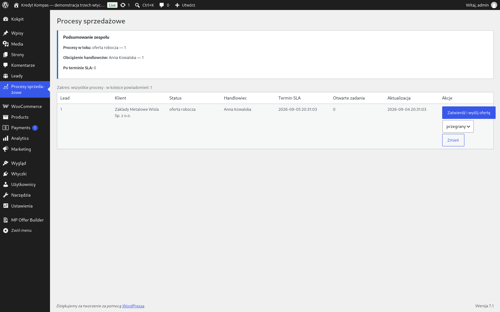
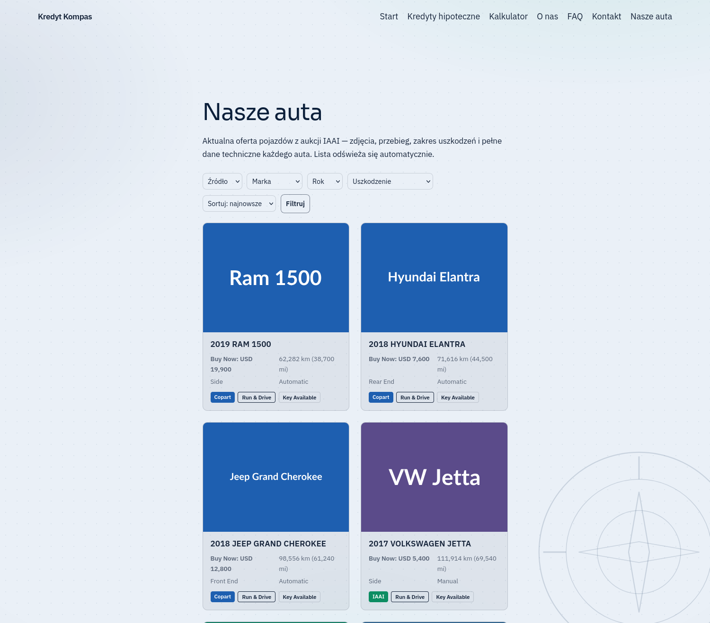
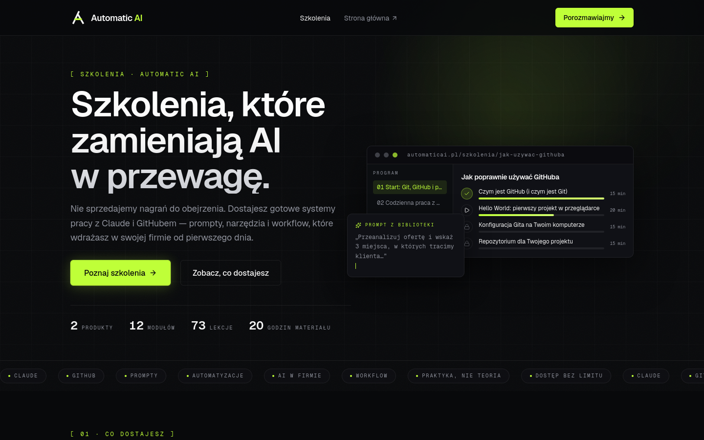

# Krzysztof Leszczyński

### 👇 Nie wierz na słowo — kliknij i zobacz, jak to działa

*Oba uruchamiają kompletnego WordPressa **w Twojej przeglądarce**. Nic nie instalujesz, nic nie konfigurujesz.*

---

## 🎯 Czym się zajmuję

> Najprościej: **jeśli ktoś u Was codziennie przepisuje te same dane z miejsca w miejsce — buduję program, który robi to za niego.**
> Nie musisz się znać na technologii. Wystarczy, że opiszesz, co dziś klikacie ręcznie.

<table>
<tr>
<td width="33%" valign="top">

### 🔁 Koniec z przepisywaniem ręcznie

Ktoś u Was przenosi dane z formularza do maila, z maila do Excela, a z Excela do systemu?

Buduję program, który robi to sam: **zapytanie od klienta zamienia się w gotową ofertę PDF** i zadanie dla handlowca. Bez jednego „kopiuj-wklej".

**Co z tego masz:** oferta wychodzi w kilka minut zamiast w pół dnia, a nikt nie zapomina o kliencie.

</td>
<td width="33%" valign="top">

### 🔌 Dane z zewnątrz, zawsze aktualne

Potrzebujesz na stronie danych, które żyją gdzie indziej — cennika dostawcy, katalogu aukcji, stanów magazynowych?

Robię most: **dane same się pobierają i same wyświetlają** u Ciebie na stronie. Też w nocy i w weekend.

**Co z tego masz:** strona jest aktualna bez Twojego udziału i bez ręcznego wgrywania plików.

</td>
<td width="33%" valign="top">

### 🤖 AI i agenty w mojej pracy

Z narzędziami AI pracuję codziennie — pomagają pisać kod, wyłapywać w nim błędy i przygotowywać dokumentację dla Ciebie.

To nie jest gadżet. To powód, dla którego **ten sam zakres robię szybciej i taniej**, niż gdybym pisał wszystko od zera.

**Co z tego masz:** krótszy termin i niższa cena — przy tej samej kontroli, bo każdą linię i tak sprawdzam ja.

</td>
</tr>
</table>

**Robię też strony i sklepy WordPress** — autorskie motywy bez sterty wtyczek, widok mobilny, SEO lokalne. Bez abonamentów, które za rok przestaną działać.

Nie wiesz, do której szufladki pasuje Twój przypadek? Napisz zwykłym językiem, co Was męczy — od tego jest pierwsza rozmowa.

---

## 🚀 Projekty

### 1. MP Offer Automation Suite — od zapytania do podpisanej oferty

Pakiet **3 wtyczek** prowadzący zapytanie ofertowe od formularza na stronie do oferty PDF i zadania u handlowca.

> **Kluczowa decyzja:** wtyczki **nie znają swoich klas ani tabel** — rozmawiają wyłącznie zdarzeniami WordPressa. Klient może wdrożyć jedną i ocenić efekt, zanim zdecyduje o reszcie. Podpięcie nowego kroku do procesu to nowa wtyczka słuchająca haka, bez dotykania istniejącego kodu.

**33 944 linii kodu produkcyjnego** i **32 767 linii testów** · **72 wydania** · CI na PHP 7.4 + 8.3 · harness procesu ze **110 niezmiennikami**

`PHP` `WordPress` `WooCommerce` `MySQL` `dompdf` `PHPCS/WPCS` `GitHub Actions`

---

### 2. Copart / IAAI Importer — cudze dane na stronie klienta

Scraper w Pythonie chodzi na VPS z timera systemd i zasila własną bazę. Wtyczka WordPress czyta ją **read-only** i renderuje katalog z filtrami.

> **Zdjęcia są hotlinkowane ze źródła** — hosting klienta zajmuje **0 MB**, czy w katalogu jest 50 czy 5000 pozycji. Gdyby scraper działał jako wtyczka, każde pobranie obciążałoby serwer klienta, a błąd mógłby położyć stronę. Rozdzielone — strona serwuje ostatnie dobre dane, nawet gdy pobieranie się wywali.

**Komplet dokumentacji dla osoby nietechnicznej:** 9 dokumentów krok po kroku + 10 plików PDF.

`Python` `PHP` `WordPress` `MySQL` `systemd` `pytest`

---

### 3. Automatic AI — sklep z kursami online

Katalog kursów, strony sprzedażowe i **automatyczne otwieranie dostępu po opłaceniu zamówienia**.

> **Świadoma decyzja: nie pisać własnej kasy ani własnego systemu kursów.** WooCommerce robi płatności bezpieczniej i utrzymuje je ktoś inny. Moją pracą jest szew między systemami — najtańsza część, a jednocześnie ta, której nie da się kupić gotowej.

Osobna wtyczka monitorująca pilnuje, czy ścieżka płatność → dostęp nadal działa. **Automatyzacja bez monitoringu to maszyna bez kontrolki** — działa, dopóki nie przestanie, i nikt nie wie kiedy.

`2 kursy` · `12 modułów` · `73 lekcje` · `20 godzin materiału`

`Next.js 16` `React 19` `TypeScript` `Tailwind` `PHP` `WordPress` `WooCommerce`

---

### 4. Czarodziejski Dworek — strona przedszkola w dwóch wariantach

Ta sama strona w dwóch wariantach: statyczny HTML i **autorski motyw WordPress bez ani jednej wtyczki**.

> **Dlaczego bez wtyczek:** każda wtyczka to zależność, która może przestać być rozwijana albo przejść na abonament. Przy kliencie bez działu IT to realne ryzyko — za dwa lata strona przestaje działać, bo wtyczka do galerii zniknęła.

Formularze przez zewnętrzną usługę: bez bazy, bez abonamentu, klucz w panelu zamiast w kodzie. Efekt uboczny — strona **nie przechowuje danych osobowych z formularza**, więc zakres obowiązków wokół RODO jest istotnie mniejszy.

`HTML5` `CSS3` `vanilla JS` `PHP` `schema.org` `WCAG` `CSP`

---

## 🧰 Tech stack

**Backend**

**WordPress**

**Frontend**

**Automatyzacja i jakość**

**AI — moje codzienne narzędzia pracy**

AI przyspiesza pisanie i sprawdzanie kodu — <b>nie zastępuje przeglądu</b>. Każda dostawa przechodzi przeze mnie i przez osobny przebieg kontrolny opisany niżej.

---

## 📊 W liczbach

Wolę pokazać, ile kodu przeszło przez ręce, niż ile ktoś przybił gwiazdek.

| | |
|---|---|
| 🔨 **~1 230 commitów własnych** w 12 repozytoriach | 507 w publicznych (licznik GitHuba) + 724 w prywatnych, których ten licznik nie widzi |
| 📦 **33 944 linii kodu produkcyjnego** w flagowym projekcie | 160 plików, 72 wydania |
| 🧪 **32 767 linii testów** — niemal tyle, co kodu | plus **110 niezmienników procesu** w CI |
| 📚 **9 dokumentów + 10 PDF** dla klienta nietechnicznego | dokumentacja to część dostawy, nie dodatek |
| ▶️ **2 klikalne demo** | klient ocenia produkt, zanim zapłaci |

Dwa pierwsze liczniki pobiera GitHub na żywo — to całość commitów w tych repozytoriach i wszystkie są moje. Trzeci dotyczy repozytorium prywatnego (668 commitów, z tego 666 moich), więc podaję liczbę wprost.

---

## 🤝 Jak pracuję

To, co odróżnia moją ofertę od „wyślę Ci ZIP-a i powodzenia":

| | |
|---|---|
| 🎬 **Najpierw demo, potem decyzja** | Dwa moje projekty mają klikalne demo. Zobaczysz, jak działa, zanim cokolwiek zapłacisz. |
| 🧩 **Modułowo, nie wszystko naraz** | Wdrażamy jeden element, oceniasz efekt, dopiero potem resztę. Nic nie zmusza Cię do całości. |
| 📖 **Dokumentacja dla Ciebie, nie dla programisty** | Instrukcja krok po kroku, żeby system działał bez mojego udziału. |
| 🔍 **Osobny przebieg kontrolny** | Komplet zielonych testów nie znaczy, że kod jest poprawny — znaczy, że przechodzi te testy, które ktoś pomyślał się napisać. Audyt mojego flagowego projektu znalazł **8 błędów krytycznych w kodzie, który przechodził wszystkie testy**. Od tego czasu zakładam osobną kontrolę w każdej dostawie. |
| 🚫 **Bez abonamentów, których nie potrzebujesz** | Jeśli da się zrobić bez płatnej wtyczki — robię bez. |

---

## 📫 Kontakt

**Napisz albo zadzwoń.** Powiedz, co robisz dziś ręcznie i jak często — odpowiem, czy da się to zautomatyzować, ile to zajmie i ile będzie kosztowało. Bez zobowiązań i bez żargonu.

## 📧 krzysztof2006oskar@wp.pl

## 📱 531 820 534

Odpowiadam w ciągu jednego dnia roboczego. Wolisz najpierw napisać niż dzwonić? Mail jest w porządku — opisz proces, resztę dopytam sam.

---

<b>🇬🇧 English summary</b>

 

I automate repetitive business processes in WordPress and WooCommerce — the ones where someone still copies data by hand between a form, an inbox and a system.

- **Custom WordPress/WooCommerce plugins** — quote-to-offer pipelines, lead qualification, PDF generation, sales workflow
- **Data integrations and scrapers** — Python on a VPS feeding a private database, read-only WordPress plugin on the front
- **E-commerce integrations** — WooCommerce wired to whatever has to happen after payment
- **AI-assisted delivery** — I work with AI coding assistants daily (Claude Code, Copilot, Cursor, Windsurf, Codex) and with ChatGPT, Gemini, Claude, DeepSeek, Grok and Perplexity for research. Same scope, shorter timeline, lower price — every line still reviewed by me
- **Websites and custom themes** — no plugin bloat, local SEO, accessibility, mobile-first

**Try before you decide** — both flagship projects ship a clickable demo that boots a full WordPress install in your browser:

Featured work: [MP Offer Automation Suite](https://github.com/krzysiek2115op/mp-offer-automation-suite) (33,944 lines of production PHP plus 32,767 lines of tests, 72 releases, CI on PHP 7.4 + 8.3, a process harness of 110 invariants) · [Copart/IAAI Importer](https://github.com/krzysiek2115op/copart-iaai-importer) (Python scraper on a VPS, read-only WordPress plugin, images hotlinked so the client's hosting uses 0 MB) · [Automatic AI course shop](https://matthewplugins.github.io/szkolenia-podglad/szkolenia) (WooCommerce wired to an LMS — payment unlocks access automatically)

**How I work:** demo before you decide · modular delivery, one piece at a time · documentation written for the person operating the system, not for a developer · AI speeds up writing and checking the code, it does not replace review · a separate verification pass on every delivery, because a green test suite only proves the code passes the tests someone thought to write.

**Contact:** [krzysztof2006oskar@wp.pl](mailto:krzysztof2006oskar@wp.pl) · +48 531 820 534 · [Facebook](https://www.facebook.com/krzysztof.leszczynski.148/) — tell me what you do by hand today and how often, and I will tell you whether it is worth automating, how long it takes and what it costs.

Masz proces, który zjada Wam czas? Napisz — powiem wprost, czy warto go automatyzować.

